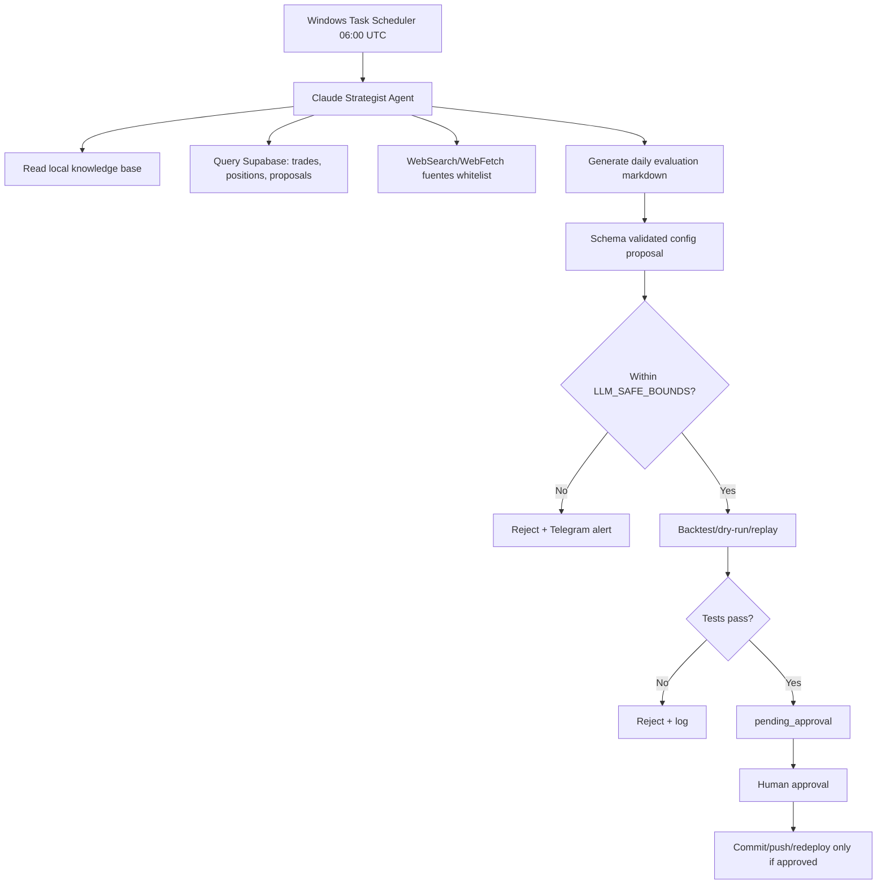

# Deep Research #2 - Repos y patrones aplicados para trading bot agentic

Fecha de investigacion: 2026-04-25  
Contexto: bot long-only en Binance Spot Testnet, backend Python/FastAPI, frontend Next.js/Supabase, estrategia `Trend-Momentum Multi-Filter`, agente tactico LangGraph + Gemini, plan de Strategist Agent con Claude Agent SDK.

> Nota: este documento es investigacion tecnica y de arquitectura. No es recomendacion financiera. Toda conclusion sobre edge debe validarse en testnet, backtest fuera de muestra y paper trading antes de mainnet.

## 1. Resumen ejecutivo

La direccion general es correcta si se mantiene una separacion estricta:

- El bot deterministico ejecuta reglas duras.
- El agente tactico propone configuracion dentro de rangos seguros.
- El nuevo Claude Strategist Agent analiza performance, contexto y deuda tecnica, pero no toma trades directos.
- Cualquier cambio material pasa por schema validation, bounds centralizados, tests, dry-run y aprobacion humana.

La estrategia actual `Trend-Momentum Multi-Filter` tiene prior art razonable como familia de reglas tecnicas en crypto: moving averages, momentum, oscillators, filtros de tendencia y volatility/trailing stops aparecen repetidamente en literatura y frameworks. Pero no hay evidencia fuerte de que exactamente la combinacion `RSI + ADX + entropy + MACD + SMA` tenga edge estable en ETH/BTC 1h en 2026. Es una hipotesis defendible, no una verdad.

El dato mas importante del sistema no es el win rate reciente, sino el diagnostico operativo:

- 62 trades historicos es una muestra chica.
- P&L total casi flat sugiere edge no demostrado.
- Los ultimos 7 dias post-fix son alentadores, pero pueden ser ruido.
- 78% de exits por `STOP_LOSS` y solo 3% por `TAKE_PROFIT` apuntan a un problema real de exits, stops, trailing, stale data o combinacion de estos.
- El bug del proxy de precios invalida parte de la lectura historica de stops.

Recomendacion:

1. Mantener trend-momentum como baseline en testnet.
2. No promover a mainnet hasta juntar 2-3 semanas limpias post-fix.
3. Implementar partial exit como experimento, no como reemplazo inmediato.
4. Agregar Binance Futures data read-only antes que fuentes premium.
5. Priorizar bounds, aprobacion y evaluacion walk-forward antes que nuevos indicadores.

## 2. Conclusiones sobre trend-momentum + partial exits

### 2.1 Trend-momentum multi-filter en crypto spot 1h

La familia trend/momentum esta respaldada como area de investigacion, pero con matices. El paper `Technical trading and cryptocurrencies` analiza reglas tecnicas en crypto, incluyendo moving averages, filters, support/resistance, oscillators y channel breakouts. Eso respalda investigar reglas tecnicas en crypto, pero no garantiza edge actual ni especifico para 1h ETH/BTC.

Punto critico: cuanto mas filtros se agregan, mas facil es sobreajustar. `RSI<50`, `ADX>20`, `entropy<0.75`, `MACD hist>-200`, `SMA20>SMA50`, cooldown, max positions y regimen son muchas decisiones. Si se optimizan mirando el mismo dataset, el riesgo de overfitting sube fuerte. La literatura sobre Probability of Backtest Overfitting y Deflated Sharpe Ratio existe justamente para corregir esta trampa.

Heuristica practica para considerar "edge real" en este caso:

- Sharpe OOS mayor a 1.0 despues de fees/slippage.
- Profit Factor OOS estable mayor a 1.2-1.4.
- 200+ trades, idealmente con varios regimenes.
- Drawdown maximo tolerable y no concentrado en pocos trades.
- Expectancy positiva por R-multiple, no solo win rate.
- Performance razonablemente similar entre backtest, testnet y paper/live small capital.

Con 62 trades y un bug de precios reciente, la postura correcta es: "hipotesis viva, edge no probado".

### 2.2 Partial exit 50% @ 1R + runner

La idea de salir 50% en 1R y dejar correr el resto con trailing es una practica conocida de gestion de riesgo. Su justificacion es mejorar la distribucion de retornos:

- Captura ganancias parciales antes de reversals.
- Reduce la presion sobre el trailing.
- Puede convertir trades que vuelven a breakeven en trades netamente positivos.
- Suele suavizar equity curve.

Pero no hay evidencia academica solida de que `50% @ 1R + runner` sea universalmente superior a un TP fijo o trailing unico. Es una regla de forma de payoff, no una fuente de alpha. Van Tharp populariza el marco de R-multiples para analizar trades, pero eso no prueba una parametrizacion concreta.

Para tu caso, vale la pena porque el sintoma operativo es muy especifico: demasiados stops y pocos take profits. La pregunta correcta no es "partial exit es mejor?", sino:

- Cuantos trades llegaron a +1R antes de terminar en SL?
- Cuanto P&L habria recuperado un partial exit?
- Cuanto reduce winners grandes por cortar 50% temprano?
- Que pasa con fees y min notional?
- El runner con Chandelier 2ATR o 3ATR mejora expectancy?

Implementacion recomendada:

- Feature flag por simbolo.
- Backtest/replay usando fills reales cuando existan.
- Configurable: `partial_exit_enabled`, `partial_exit_fraction`, `partial_exit_r`, `runner_trailing_atr_k`, `move_stop_to_breakeven`.
- Empezar con ETHUSDT primero, porque tiene mejor comportamiento reciente.
- Mantener BTCUSDT con menor notional o solo baseline hasta que mejore.

### 2.3 Chandelier 2ATR vs 3ATR

El Chandelier Exit clasico suele usar `22-period high/low - 3 * ATR`. Usar 2ATR hace el stop mas cercano:

- Ventaja: protege ganancias antes.
- Desventaja: mas whipsaws, especialmente en crypto 1h.

Con 78% de exits por SL, 2ATR puede ser demasiado apretado si el problema no era solo el proxy stale. La comparacion minima a correr:

- Baseline actual.
- Partial 50% @1R + Chandelier 2ATR.
- Partial 50% @1R + Chandelier 3ATR.
- Partial 50% @1R + trailing fijo porcentual.
- No partial + Chandelier 3ATR.

## 3. Failure modes documentados y mitigaciones

### 3.1 De la estrategia

1. Sobreajuste por filtros multiples  
   Mitigacion: walk-forward, OOS, Deflated Sharpe, limite de cambios por semana.

2. Regimen lateral con falsas rupturas  
   Mitigacion: filtro de rango/volatilidad, entropy/regime detector, no-trade zones.

3. Stops demasiado apretados  
   Mitigacion: ATR k mayor, partial exit, stop-to-breakeven solo despues de progreso real.

4. Data stale o inconsistente  
   Mitigacion: freshness checks, cross-check de ticker/kline/orderbook, auditoria de trigger vs execution.

5. Costos subestimados  
   Mitigacion: simular fees reales, slippage conservador y min notional. Binance Spot Testnet no siempre esta sincronizado con live y sus settings pueden ser solo para testing.

6. Edge decay  
   Mitigacion: rolling expectancy, rolling PF, drift alerts, strategy cooldown.

### 3.2 Del agente LLM supervisor

1. Hallucination numerica  
   Mitigacion: JSON schema, bounds centralizados, reject on invalid.

2. Optimization churn  
   Mitigacion: un cambio material por ciclo, minimum evidence threshold, config cooldown.

3. Research storms  
   Mitigacion: limite de fuentes, limite de tokens, timeout por fase, whitelist.

4. Autoridad excesiva  
   Mitigacion: el agente propone, no ejecuta trading. Deploy automatico solo para docs o configs preaprobadas.

5. Drift entre prompt e implementacion  
   Mitigacion: tests de contrato, snapshots de output, revision humana para cambios de parametros.

6. Secret leakage en tools  
   Mitigacion: allowlist de comandos, redaccion de logs, secrets fuera del prompt.

7. Dependencia de PC personal  
   Mitigacion: heartbeat, logs persistentes, lock file, notificacion si no corrio, plan B manual.

## 4. Tabla comparativa de repos

Metadata recolectada via GitHub API el 2026-04-25.

| Repo | Stars | Licencia | Ultima actividad observada | Que tomar | Que evitar | Prioridad |
|---|---:|---|---|---|---|---|
| Freqtrade | 49.3k | GPL-3.0 | 2026-04-24/25 | Reportes de backtesting, hyperopt spaces/losses, protections, lookahead/recursive analysis, estructura de estrategia | Copiar codigo GPL, migrar engine, hiperoptimizar parametros chicos | Alta |
| Jesse | 7.8k | MIT | 2026-04 | Lifecycle de estrategia, tests de TP/SL spot, partial exits, sizing utilities | Reemplazar tu backend/event loop | Alta |
| vectorbt | 7.3k | Apache 2.0 + Commons Clause | 2026-04 | Notebooks de investigacion rapida, sweeps vectorizados, comparacion de exits | Embebido productivo, asumir fills perfectos | Alta como research |
| NautilusTrader | 22.3k | LGPL-3.0 | 2026-04 | Separacion portfolio/risk/execution, arquitectura event-driven, auditoria conceptual | Adoptarlo completo, sobreingenieria | Media |
| cryptofeed | 2.8k | BSD-like | 2026-02 | Websockets normalizados, cross-exchange feeds | Meter complejidad antes de probar Binance Futures API | Media |
| CCXT | 42.1k | MIT | 2026-04 | Normalizacion multi-exchange, fallback para research | Usarlo para Binance-specific execution si ya tenes connector dedicado | Media |
| binance-connector-python | 2.8k | MIT | 2026-04 | Fuente preferida para endpoints especificos Binance | Mezclar wrappers sin necesidad | Media |
| python-binance | 7.1k | MIT | 2026-03 | Referencia comunitaria y ejemplos | Depender de features especificas si el conector oficial las cubre | Media-baja |
| Hummingbot | 18.3k | Apache-2.0 | 2026-04 | Ideas de conectores y reconciliacion si vas a market making | Es otro dominio: market making, inventory, spreads | Baja |
| OctoBot | 5.8k | GPL-3.0 | 2026-04 | Ideas UX/plugin retail | Copiar codigo GPL, adoptar arquitectura | Baja |
| backtrader | 21.3k | GPL-3.0 | 2024 push observado | Conceptos de analyzers/order model | Nuevo desarrollo serio | Baja |

### 4.1 Freqtrade

Freqtrade es el repo mas util para inspirarse en evaluacion, no para copiar codigo. Sus piezas mas relevantes:

- `freqtrade/optimize/backtesting.py`
- `freqtrade/optimize/hyperopt/`
- `freqtrade/optimize/hyperopt_loss/`
- `freqtrade/strategy/interface.py`
- Documentacion de backtesting, hyperopt, protections, lookahead analysis y recursive analysis.

Patrones para adaptar:

- Separar strategy parameters de execution parameters.
- Reportes comparables entre runs.
- Validaciones contra lookahead bias.
- Loss functions explicitas para optimizacion.
- Protections como cooldowns y drawdown guards.

No copiar codigo por GPL-3.0 salvo que aceptes implicancias de licencia.

### 4.2 Jesse

Jesse es mas cercano a tu necesidad de aprender sobre exits y estado de posiciones. La licencia MIT lo hace mas facil de estudiar/adaptar.

Piezas a leer:

- `jesse/strategies/Strategy.py`
- Tests de take-profit y stop-loss en spot.
- Modelos de orders/trades.
- Utilidades de sizing.

Patrones utiles:

- Tratar partial exits como maquina de estados.
- Tests especificos para "TP parcial ejecutado antes del SL".
- Invariantes: el stop debe considerar cantidad restante, no cantidad original.
- Separar decision signal de order management.

### 4.3 vectorbt

vectorbt sirve para investigacion rapida. Es muy util para comparar variantes de salida, pero no reemplaza un backtest event-driven cuando hay partial fills, min notional, OCO/OTOCO, fees y estado de ordenes.

Uso recomendado:

- Notebook local para sweep de `ATR k`, `partial_exit_r`, `partial_fraction`.
- Comparar equity curves, expectancy por R, rolling PF.
- Usarlo como filtro inicial antes de implementar en el bot.

Riesgo:

- La licencia actual incluye Commons Clause.
- No conviene copiar codigo ni meterlo como dependencia productiva sin revisar implicancias.

### 4.4 NautilusTrader

NautilusTrader es profesional y serio, pero demasiado grande para tu caso. Valor principal: arquitectura conceptual.

Leer para aprender:

- `nautilus_trader/backtest/`
- `nautilus_trader/risk/`
- `nautilus_trader/portfolio/`
- `nautilus_trader/execution/`

Extraer ideas:

- Risk engine separado.
- Portfolio separado.
- Execution separado.
- Eventos auditables.

No intentar migrar tu bot.

### 4.5 Hummingbot, OctoBot y backtrader

Hummingbot es valioso si el problema fuera market making o conectores, no para trend-momentum long-only. OctoBot es mas retail/plugin oriented y GPL. backtrader es clasico, pero no es la mejor inversion nueva para crypto agentic en 2026.

### 4.6 Repos LLM + trading

La busqueda encontro varios repos con stars, pero la mayoria caen en tres categorias:

- Demos de agentes que leen noticias/charts.
- MCPs para TradingView o charting.
- Bots sin auditoria publica seria de performance.

Ejemplos vistos:

- `tradesdontlie/tradingview-mcp`
- `atilaahmettaner/tradingview-mcp`
- `tradermonty/claude-trading-skills`
- `ginlix-ai/LangAlpha`
- `EthanAlgoX/LLM-TradeBot`

Conclusion: usarlos como inspiracion de tool UX o anti-patrones, no como base de produccion.

## 5. Patrones para AI agent supervisando un bot

El patron defendible es "LLM como estratega/auditor", no "LLM como trader".

Arquitectura recomendada:

Guardrails minimos:

- `LLM_SAFE_BOUNDS` como unica fuente de verdad.
- Output del agente en JSON schema versionado.
- Markdown diario obligatorio con hipotesis, evidencia y decision.
- No mas de una modificacion material por run.
- No cambios si hay datos stale o reconciliacion fallida.
- No deploy si tests fallan.
- No pausa automatica del bot salvo breaker deterministico.
- Telegram con resumen y diff.
- Branch o commit con prefijo claro: `strategist/YYYY-MM-DD`.

Decision sobre hosting local:

- Windows Task Scheduler esta bien para rol estrategico diario.
- No lo usaria para ejecucion tactica ni monitoreo critico.
- Agregar lock file para evitar corridas simultaneas.
- Agregar heartbeat si no corrio.
- Logs persistentes en archivo y Supabase.

## 6. Top 5 mejoras priorizadas

### 1. Bounds centralizados + approval workflow

Mayor ROI. Antes de mas alpha, cerrar seguridad.

Implementar:

- Un archivo o modulo canonico para `LLM_SAFE_BOUNDS`.
- Validacion Pydantic/Zod segun backend/frontend.
- Tabla `pending_approval`.
- Rechazo automatico si el agente propone fuera de rango.
- Tests unitarios para clamp y reject.

### 2. Partial exit 50% @ 1R + runner

Implementar como experimento controlado.

Metricas:

- Expectancy por trade.
- Expectancy por R.
- Porcentaje de trades que tocaron +1R antes de SL.
- P&L ganado/perdido vs baseline.
- Impacto en max drawdown.
- Impacto en ETH vs BTC separado.

### 3. Derivatives data read-only

Empezar por Binance oficial:

- Funding rate.
- Open interest.
- Top trader long/short ratio.
- Global long/short ratio.
- Liquidation streams.

Uso sugerido:

- No como entry directo.
- Como feature de regimen o veto.
- Ejemplo: evitar longs cuando funding esta extremo positivo, OI sube fuerte y precio falla breakout.

### 4. Walk-forward report

Inspirarse en Freqtrade:

- Train/validation/test temporal.
- Rolling windows.
- Separar ETH y BTC.
- Reportar performance por regimen.
- Incluir fees y slippage conservador.

### 5. ATR-based sizing + time-of-day filter

Baja complejidad y buen efecto sobre riesgo.

Ideas:

- Notional inversamente proporcional a ATR%.
- Cap por simbolo.
- Reducir notional en regimen de volatilidad extrema.
- Evitar entradas en horas historicamente iliquidas o con peor expectancy.

## 7. Papers, docs y blogs para leer

1. Technical trading and cryptocurrencies  
   Link: https://link.springer.com/article/10.1007/s10479-019-03357-1  
   Por que importa: valida que reglas tecnicas en crypto son un area estudiada, pero tambien muestra que se deben evaluar muchas reglas con cuidado.

2. Probability of Backtest Overfitting  
   Link: https://papers.ssrn.com/sol3/papers.cfm?abstract_id=2326253  
   Por que importa: tu combinacion de filtros y muestra chica puede generar falsos positivos.

3. Deflated Sharpe Ratio  
   Link: https://www.davidhbailey.com/dhbpapers/deflated-sharpe.pdf  
   Por que importa: corrige Sharpe inflado por multiples pruebas/seleccion.

4. Van Tharp R-multiples  
   Link: https://vantharp.com/wp-content/uploads/2018/06/A_Short_Lesson_on_R_and_R-multiple.pdf  
   Por que importa: marco practico para medir partial exits y expectancy en unidades R.

5. Chandelier Exit, StockCharts  
   Link: https://chartschool.stockcharts.com/table-of-contents/technical-indicators-and-overlays/technical-overlays/chandelier-exit  
   Por que importa: referencia clara del trailing stop y su parametro ATR.

6. Anthropic Agent SDK overview  
   Link: https://platform.claude.com/docs/en/agent-sdk/overview  
   Por que importa: base oficial para construir el Strategist Agent.

7. Anthropic Agent SDK permissions  
   Link: https://platform.claude.com/docs/en/agent-sdk/permissions  
   Por que importa: controles de tools, aprobaciones y seguridad.

8. Binance Spot Testnet docs  
   Link: https://developers.binance.com/docs/binance-spot-api-docs/testnet  
   Por que importa: testnet no siempre esta sincronizado con live y puede tener resets/settings de prueba.

9. Binance USD-M Futures API  
   Links:
   - Funding: https://developers.binance.com/docs/derivatives/usds-margined-futures/market-data/rest-api/Get-Funding-Rate-History
   - Open interest: https://developers.binance.com/docs/derivatives/usds-margined-futures/market-data/rest-api/Open-Interest
   - Top trader long/short: https://developers.binance.com/docs/derivatives/usds-margined-futures/market-data/rest-api/Top-Trader-Long-Short-Ratio
   - Liquidations: https://developers.binance.com/docs/derivatives/usds-margined-futures/websocket-market-streams/Liquidation-Order-Streams

10. Freqtrade docs  
    Links:
    - Backtesting: https://www.freqtrade.io/en/stable/backtesting/
    - Hyperopt: https://www.freqtrade.io/en/stable/hyperopt/
    Por que importa: patrones de evaluacion, no codigo para copiar.

## 8. Plan de aprendizaje extractivo de 2 semanas

### Semana 1

Dia 1 - Freqtrade evaluacion  
Leer:

- `freqtrade/optimize/backtesting.py`
- `freqtrade/optimize/hyperopt/`
- `freqtrade/optimize/hyperopt_loss/`
- docs de backtesting/hyperopt.

Extraer:

- Formato de reportes.
- Separacion de parametros.
- Ideas de protections.
- Checklist anti-overfitting.

Tiempo: 1 dia.

Dia 2 - Jesse exits  
Leer:

- `jesse/strategies/Strategy.py`
- tests de take-profit/stop-loss spot.
- modelos de orders/trades.

Extraer:

- Maquina de estados para partial exits.
- Tests de quantity restante tras TP parcial.
- Invariantes para stop despues de partial.

Tiempo: 1 dia.

Dia 3 - Binance Futures read-only  
Implementar collector minimo:

- Funding.
- OI.
- Top long/short.
- Global long/short si aplica.
- Liquidations si websocket es simple de aislar.

Persistir snapshot por simbolo/hora.

Tiempo: 1 dia.

Dia 4 - Bounds + approval  
Implementar:

- Fuente unica de bounds.
- Schema validator.
- Tabla `pending_approval`.
- Telegram summary.

Tiempo: 1 dia.

Dia 5 - Partial exit backtest/replay  
Construir comparativa:

- Baseline.
- 50% @1R + runner 2ATR.
- 50% @1R + runner 3ATR.
- No partial + 3ATR.

Tiempo: 1 dia.

### Semana 2

Dia 6 - vectorbt notebook  
Crear notebook rapido para sweeps de exits y ATR.

Tiempo: medio dia a 1 dia.

Dia 7 - NautilusTrader arquitectura  
Leer solo conceptual:

- risk
- portfolio
- execution
- backtest

Extraer nombres de componentes y responsabilidades.

Tiempo: medio dia.

Dia 8 - Claude Strategist dry-run  
Implementar primer agente local:

- Read docs.
- Query Supabase.
- Web fetch whitelist.
- Generar markdown diario.
- Proponer config JSON.
- No escribir config productiva.

Tiempo: 1 dia.

Dia 9 - CI y approval  
Agregar:

- tests requeridos.
- diff de config.
- approval manual.
- commit solo si aprobado.

Tiempo: 1 dia.

Dia 10 - Replay y decision gate  
Correr sobre historico:

- Que habria propuesto el agente.
- Cuantos cambios habria hecho.
- Si hubiera empeorado o mejorado.
- Si respeto bounds.

Tiempo: 1 dia.

## 9. Decision final

No hay razon para tirar el stack ni migrar a Freqtrade/Jesse/Nautilus. Tu stack actual es defendible si se endurece la capa de evaluacion y seguridad.

El orden correcto es:

1. Validar que el fix del proxy elimino falsos stops.
2. Centralizar bounds.
3. Agregar approval workflow.
4. Probar partial exit con replay/backtest.
5. Incorporar Futures data read-only.
6. Recien despues permitir que Claude Strategist proponga cambios diarios.

El mayor riesgo no es que falte un indicador. El mayor riesgo es que el sistema se convenza de un edge con poca muestra, datos contaminados o cambios diarios explicados por narrativas plausibles. El agente debe ser un auditor con permisos limitados, no una fuente autonoma de autoridad.

## 10. Fuentes

- Freqtrade repo: https://github.com/freqtrade/freqtrade
- Freqtrade backtesting: https://www.freqtrade.io/en/stable/backtesting/
- Freqtrade hyperopt: https://www.freqtrade.io/en/stable/hyperopt/
- Jesse repo: https://github.com/jesse-ai/jesse
- Hummingbot repo: https://github.com/hummingbot/hummingbot
- OctoBot repo: https://github.com/Drakkar-Software/OctoBot
- NautilusTrader repo: https://github.com/nautechsystems/nautilus_trader
- NautilusTrader docs: https://nautilustrader.io/docs/latest/
- vectorbt docs: https://vectorbt.dev/
- backtrader repo: https://github.com/mementum/backtrader
- CCXT repo: https://github.com/ccxt/ccxt
- CCXT docs: https://docs.ccxt.com/
- python-binance repo: https://github.com/sammchardy/python-binance
- Binance connector Python: https://github.com/binance/binance-connector-python
- cryptofeed repo: https://github.com/bmoscon/cryptofeed
- Anthropic Agent SDK overview: https://platform.claude.com/docs/en/agent-sdk/overview
- Anthropic Agent SDK quickstart: https://platform.claude.com/docs/en/agent-sdk/quickstart
- Anthropic Agent SDK permissions: https://platform.claude.com/docs/en/agent-sdk/permissions
- Binance Spot Testnet docs: https://developers.binance.com/docs/binance-spot-api-docs/testnet
- Binance Futures funding: https://developers.binance.com/docs/derivatives/usds-margined-futures/market-data/rest-api/Get-Funding-Rate-History
- Binance Futures open interest: https://developers.binance.com/docs/derivatives/usds-margined-futures/market-data/rest-api/Open-Interest
- Binance Futures top trader ratio: https://developers.binance.com/docs/derivatives/usds-margined-futures/market-data/rest-api/Top-Trader-Long-Short-Ratio
- Binance Futures liquidation stream: https://developers.binance.com/docs/derivatives/usds-margined-futures/websocket-market-streams/Liquidation-Order-Streams
- Technical trading and cryptocurrencies: https://link.springer.com/article/10.1007/s10479-019-03357-1
- Probability of Backtest Overfitting: https://papers.ssrn.com/sol3/papers.cfm?abstract_id=2326253
- Deflated Sharpe Ratio: https://www.davidhbailey.com/dhbpapers/deflated-sharpe.pdf
- Van Tharp R-multiples: https://vantharp.com/wp-content/uploads/2018/06/A_Short_Lesson_on_R_and_R-multiple.pdf
- Chandelier Exit: https://chartschool.stockcharts.com/table-of-contents/technical-indicators-and-overlays/technical-overlays/chandelier-exit
- Survey de LLM agents en trading: https://arxiv.org/abs/2408.06361
- StockAgent: https://arxiv.org/abs/2407.18957
- LLM strategic deception risk: https://openreview.net/pdf?id=HduMpot9sJ
