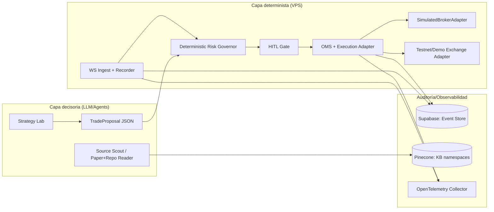

# Validación end-to-end en entorno simulado para un sistema multiagente de trading en BTC

## Resumen ejecutivo

Sí, Nahuel: **la manera correcta** de probar un sistema multiagente que termina en ejecución por API (aunque sea con aprobación humana) es montar un **entorno de pruebas reproducible** que combine **(a) simulación propia** (para controlar fills/slippage/latencia) con **(b) testnet/demo del exchange** (para validar autenticación, rate limits, WebSockets, estados de órdenes e idempotencia). Con “solo testnet” vas a tener un sistema que *funciona* pero **te miente** en PnL y riesgo por cómo se llenan órdenes (o por cómo *no* se llenan). Esa necesidad de simulación de alta fidelidad está respaldada por literatura y tooling de simulación de mercado (ABIDES, QuantReplay), que existen precisamente porque en trading realista la microestructura/latencias importan. citeturn4search4turn4search1

Tu documento base ya plantea lo esencial (MVP con paper trading + HITL + telemetría, y separación estricta entre capa de razonamiento y capa determinista). fileciteturn0file0  
La parte crítica que faltaba para que un **agente de codificación** lo implemente sin improvisar es: **contratos de OMS, modelo de fills realista, replay controlado, auditoría/event-sourcing y un harness de pruebas con métricas Go/No-Go**. El resto (multiagentes, RAG, “contexto justo”) es importante, pero **no te salva** si la ejecución y el QA están flojos: ahí es donde mueren los bots.

## Entornos de inversión simulada y cuándo usar cada uno

Un entorno de pruebas serio no es uno solo; son **tres capas**, cada una captura un tipo distinto de riesgo:

**Backtesting histórico (offline)**: mata errores de lógica y valida hipótesis a bajo costo. Pero necesita modelar fricción; por ejemplo Backtrader reconoce explícitamente que no puede garantizar condiciones reales y provee slippage configurable en su broker de backtesting. citeturn10search2

**Paper trading “live” con broker simulado interno (shadow)**: consumís datos reales en vivo, pero ejecutás en un **SimulatedBroker** que vos controlás (fills parciales, slippage, colas, rechazos). Esta capa es la que más te acerca a producción con control total, y es donde medís latencia end‑to‑end real (señal→orden propuesta→aprobación→orden). La necesidad de “reality modeling” (ej. slippage) para que los resultados no sean fantasía está explícita en la documentación de QuantConnect/LEAN. citeturn10search0

**Testnet/Demo del exchange**: valida plumbing con el proveedor: autenticación HMAC, endpoints, WebSockets, conexiones que expiran, keep-alives, limitaciones de funciones, etc. Por ejemplo, Binance especifica bases de testnet/demos y reglas como expiración de conexiones WebSocket y pings. citeturn0search5turn0search8

La lectura institucional es: **no avanzás a “small live”** hasta que las tres capas estén verdes y los resultados sean coherentes (o al menos explicables) entre ellas. Además, si tu sistema usa agentes que navegan web/herramientas, tenés que asumir prompt injection como riesgo real y diseñar para dañabilidad baja (gates deterministas, permisos mínimos, validación estructural). citeturn3search2turn7search0

## Testnets y demos de exchanges para BTC spot y derivados

A continuación están los entornos de prueba más relevantes para BTC spot y derivados (short vía perps/futuros), con endpoints oficiales y limitaciones operativas.

**Binance (Spot Testnet + Futures Testnet/Demo)**  
En Spot Testnet, la documentación oficial indica que el endpoint REST base es `https://testnet.binance.vision/api`. citeturn0search0  
En WebSocket API para Spot Testnet, el endpoint base de testnet está documentado como `wss://ws-api.testnet.binance.vision/ws-api/v3` y se aclara que las conexiones tienen validez limitada (24h) y que soportan distintos tipos de claves. citeturn0search8  
Para streams (market data) en Spot Testnet, el endpoint base se documenta como `wss://stream.testnet.binance.vision/ws` y soporta streams raw o combinados. citeturn0search16  
Además, Binance publicó un cambio relevante: desde 2024‑05‑30 esa URL pasa a ser primaria y otras se “phasing out” (detalle importante si usás SDKs viejos). citeturn0search15  

En USDⓈ‑M Futures Testnet, la doc indica base REST `https://demo-fapi.binance.com`. citeturn0search1  
Para WebSocket API (Futures), Binance documenta explícitamente el endpoint base de testnet `wss://testnet.binancefuture.com/ws-fapi/v1`, la expiración a 24h y pings periódicos (si no devolvés pong, te desconectan). citeturn0search5  
Sobre **cómo obtener credenciales** para el entorno demo futures, Binance describe el flujo de “Futures Demo Trading” y la creación de API keys desde “API Management”. citeturn11search2  
Punto crítico: integraciones genéricas pueden romperse por cambios de URLs. Hay evidencia operativa de que librerías como CCXT pueden quedar desalineadas con cambios del Spot Testnet y causar errores de autenticación si no se actualizan. citeturn5search3turn0search15  

**Bybit (Testnet v5: REST + WebSocket + Order Entry)**  
Bybit documenta el endpoint REST de testnet como `https://api-testnet.bybit.com`. citeturn1search5  
En WebSockets v5, Bybit lista endpoints de testnet para streams públicos (spot/linear/inverse/options), stream privado y “WebSocket Order Entry” (trade) **también en testnet** (además de parámetros como `max_active_time`, límites de conexiones e instrucciones de heartbeat/ping, con recomendación práctica de ping cada ~20s). citeturn13view0  
Creación de API keys: la guía de Bybit indica el panel de “API Management” y distingue mainnet vs testnet (URL de settings testnet). citeturn1search4turn11search7  
Corrección importante (porque en tu texto original había una referencia equivocada): el link “netr/go-coinbasev3” es **Coinbase**, no Bybit; para Bybit, la fuente primaria es la documentación v5 (GitHub pages) y el help center oficial. citeturn1search5turn13view0turn11search7  

**OKX (Demo Trading API v5: REST + WebSocket, header obligatorio)**  
OKX documenta “Demo Trading Services” con URLs dedicadas: REST `https://eea.okx.com` y WebSockets públicos/privados/business bajo `wss://wseeapap.okx.com:8443/ws/v5/...`. También aclara que algunas funciones no están soportadas (ej. withdraw/deposit). citeturn1search3  
Para operar en demo, OKX exige un **APIKey de “demo trading”** y que el header `x-simulated-trading` sea `1`; además documenta el típico error por mismatch de ambiente (APIKey real vs demo). citeturn11search10turn0search13  
En español, OKX confirma que provee entorno de “trading demo” y que se crean claves API específicas para ese fin. citeturn11search14turn11search0  

image_group{"layout":"carousel","aspect_ratio":"16:9","query":["Binance Spot Testnet dashboard","Bybit testnet API management page","OKX demo trading API key create","QuantReplay market simulator open source"],"num_per_query":1}

**Cómo elegir exchange de prueba (criterio práctico)**  
Si tu objetivo es “segundos/minutos” y derivados para short, priorizá: (1) endpoints WS robustos + order entry, (2) claridad de “demo trading” y keys, (3) facilidad de registrar y reproducir market data. Bybit brilla por endpoints WS documentados (incluye trade WS y private en testnet). citeturn13view0  
OKX es muy bueno si querés un demo con URLs separadas y señalización explícita por header. citeturn1search3turn11search10  
Binance tiene documentación fuerte y gran ecosistema, pero exige mucho cuidado con cambios de URLs y compatibilidad de librerías. citeturn0search15turn5search3  

## Simulación de fills, slippage y market replay

Aquí es donde se separa un “bot de YouTube” de un sistema defendible. La prueba real no es “puedo enviar una orden”, sino: **¿cómo se llena? ¿a qué precio? ¿cuánto tarda? ¿qué pasa si hay reconexiones o staleness?**

**Tres niveles de realismo (recomendación por presupuesto USD 20/mes)**

**Nivel mínimo (bar/L1)**: fills contra bid/ask (top-of-book) + fee maker/taker fijo + slippage estocástico (p.ej. función de volatilidad o spread). Es imperfecto, pero barato y útil para micro‑swing (no HFT). Backtrader y LEAN/QuantConnect muestran explícitamente que slippage y comisiones deben modelarse para realismo. citeturn10search2turn10search0  

**Nivel medio (L2 replay)**: grabás snapshots + updates L2 (order book) de BTCUSDT y reproducís el stream. Bybit documenta sus tópicos de order book y el ciclo de heartbeat/reconexión, lo que facilita construir un grabador/replayer robusto. citeturn13view0  
Para Spot Testnet de Binance también existen streams con formato de raw/combined streams, adecuados para capturar y luego reproducir. citeturn0search16  
Esto te permite simular partial fills y slippage por profundidad (sin pagar data L3): **grabás tu propia data en vivo** durante días/semanas, dentro del presupuesto.

**Nivel alto (matching engine/simulación de microestructura)**: si querés validar latencia/performance y reglas de matching con más fidelidad, hay herramientas open-source orientadas a eso. QuantReplay se define como simulador open-source con perfiles configurables de latencia, profundidad y microestructura; útil para “market replay” y stress tests. citeturn4search1turn4search17  
ABIDES (paper y repo) fue creado como simulador discreto de eventos para investigación de agentes en mercados y modela latencias por mensajería; es más cercano a un “laboratorio de microestructura” que a un backtester clásico. citeturn4search4turn4search0  

**Por qué testnet no alcanza para fills**  
Los testnets/demos validan el API contract, pero no garantizan microestructura realista (profundidad, colas, adverse selection). La propia existencia de simuladores de alta fidelidad (ABIDES/QuantReplay) y la insistencia en modelar slippage en engines serios indican el gap “backtest/testnet vs real”. citeturn4search4turn10search0  

**Nota crítica sobre data leakage y “sobreajuste de simulación”**  
Tu simulador puede generar **falsos positivos**: si el fill model es demasiado “bondadoso”, el bot parece rentable; si es demasiado “hostil”, descartás estrategias buenas. Por eso necesitás calibración por experimentos (ver checklist final) y controles de look‑ahead bias; QuantConnect explica que el “time frontier” reduce el riesgo, pero no lo elimina, especialmente con datasets custom. citeturn10search4turn10search7  

## Auditoría, observabilidad y reproducibilidad en pruebas

En un MVP con HITL y dinero (aunque simulado), la auditoría no es decoración: es tu “caja negra”.

**Event sourcing como base de auditoría**  
Microsoft documenta el patrón Event Sourcing enfatizando que el almacén append‑only de eventos provee un audit trail y permite reconstruir estado por replay, útil para testing y debugging. citeturn9search0  
Para trading: cada ciclo debe quedar como eventos (DATA_INGESTED → SIGNAL → PROPOSAL → RISK_DECISION → HITL_DECISION → ORDER_SENT → ACK/REJECT → FILL/PARTIAL → POSITION_UPDATE → PNL_UPDATE → POST_MORTEM).

**Supabase como event store + control de acceso**  
Supabase muestra una implementación práctica de auditoría en Postgres (“Postgres Auditing in 150 lines of SQL”), útil para tracking de cambios con triggers. citeturn9search1  
Para aislar entornos (sandbox/uat/prod) y roles (aprobador vs operador), Row Level Security (RLS) es un control estándar en Postgres y Supabase lo expone como feature. citeturn3search7turn3search13  
Además, Supabase provee Logs Explorer (retención por plan), útil para un QA con evidencias. citeturn9search2  

**OpenTelemetry para trazas end‑to‑end**  
OpenTelemetry define traces como spans para operaciones y permite exportarlas a un collector/backend. citeturn9search3  
Su especificación de logs extiende la correlación con traces incorporando TraceId/SpanId en LogRecords, habilitando debug forense (por ejemplo: “esta orden se envió con este contexto y este estado del risk engine”). citeturn9search7turn3search3  

**Seguridad específica de agentes (para que el QA no sea una trampa)**  
OWASP Top 10 for LLM Applications lista Prompt Injection, Insecure Output Handling y Supply Chain como riesgos top. citeturn3search2turn3search6  
El paper de “Prompt Injection attack against LLM-integrated applications” demuestra que ataques reales existen y pueden llevar a outcomes severos (exfiltración, abuso de herramientas). Eso obliga a que el **Risk Governor sea determinista y no sobreescribible por texto**, y que las tools estén whitelisteadas y validadas por JSON schema, no por “instrucciones”. citeturn7search0  

## Blueprint de implementación y checklist Go/No-Go

### Matriz de decisión operativa para pruebas

| Combinación | Qué valida bien | Qué te puede mentir | Complejidad | Recomendación |
|---|---|---|---:|---|
| Solo testnet/demo | Auth, endpoints, WS, estados de orden | Fills/slippage, microestructura | Baja | No suficiente |
| Solo simulador local | Fills/slippage/latencia controlada | Integración real con exchange | Media | Bueno pero incompleto |
| Híbrido (sim local + testnet) | End‑to‑end y realismo | Requiere disciplina de datos | Media | **Top‑1** citeturn0search5turn4search1 |

### Arquitectura mínima reproducible

Soporte HITL: LangGraph permite “interrupts” que pausan el grafo y persisten estado para reanudar tras aprobación humana. citeturn2search0turn2search4  

### Step-by-step (orientado a un agente de codificación)

**Estructura de repo sugerida**
- `exec-core/` (Python): market ingest, OMS, risk governor, adapters
- `agents/` (LangGraph): workflow de propuesta + interrupt HITL
- `control-plane/` (Next/TS): UI approve/edit/reject + dashboard
- `infra/` (docker-compose): otel-collector + storage local opcional

**Pasos concretos**
1) **Configurar testnet/demo keys**  
   - Bybit: endpoint REST testnet `https://api-testnet.bybit.com` y panel de API key en testnet. citeturn1search5turn11search7  
   - OKX: crear APIKey de demo, usar header `x-simulated-trading: 1` y URLs demo `https://eea.okx.com` + WS `wseeapap...`. citeturn1search3turn11search10  
   - Binance: Spot Testnet endpoints documentados; para Futures Demo Trading se documenta creación de API key en API Management del demo. citeturn0search0turn11search2  

2) **Implementar market ingest por WebSocket con reconexión, heartbeat y “staleness detection”**  
   - Bybit recomienda heartbeat/ping y tiene límites de conexiones y expiraciones configurables (`max_active_time`). citeturn13view0  
   - Binance WS tiene reglas de ping/pong y expiración (24h) en WS API de futures y spot. citeturn0search5turn0search8  

3) **Construir SimulatedBrokerAdapter (paper live)**  
   - Comisiones + slippage: partir de modelos simples (porcentaje) y escalar a L2 replay. Backtrader provee parámetros de slippage y esquemas de comisiones; usalo como referencia de API y filosofía. citeturn10search2turn10search5  

4) **OMS + idempotencia + reconciliación**  
   - Regla: cada “OrderSent” debe tener correlation-id, y al reiniciar el proceso debe reconsultar open orders/positions y reconciliar contra el event store (no asumir memoria). Esto no es “nice-to-have”; es cómo se evita que un bot duplique órdenes tras una caída. (Los testnets son ideales para validar esto sin riesgo). citeturn0search5turn1search3  

5) **Risk Governor determinista (hard gate)**  
   - Nunca permitas que el LLM defina size/leverage directamente: propone; el governor calcula y valida.  
   - Kill-switch mínimo: (i) stale market data, (ii) latencia p95 fuera de umbral, (iii) N rejects consecutivos, (iv) daily loss breach, (v) divergencia de posición (OMS vs exchange), (vi) error de firma/auth. Los límites de conexión/heartbeat de WS hacen esto medible. citeturn13view0turn0search5  

6) **Workflow LangGraph mínimo con pausa HITL**  
   - Nodo “StrategyLab” produce `TradeProposal` (JSON schema).  
   - Nodo “RiskGovernor” produce `RiskDecision`.  
   - Nodo “HITLGate” lanza interrupt con decisiones `approve/edit/reject`. citeturn2search0turn2search4  

7) **Auditoría con event sourcing + hashes de evidencia**  
   - Implementar tabla append-only y cadena de hashes (`prev_hash`, `hash`) por run_id. Conceptualmente, esto cumple el objetivo de audit trail sin necesidad de blockchain. Event sourcing está documentado como patrón de auditoría y replay. citeturn9search0  

8) **Telemetría con OpenTelemetry**  
   - Cada propuesta/orden/fill debe emitir spans; logs con TraceId/SpanId para correlación. citeturn9search7turn9search3  

### Checklist Go/No-Go para pasar de paper → small live

**No-Go automático si:**
- El fill model no está calibrado (slippage/fees) o no hay replay controlado: te vas a engañar. citeturn10search0turn4search1  
- No hay reconciliación robusta (posiciones/órdenes) tras restart. citeturn0search5turn1search3  
- No hay mitigación fuerte contra prompt injection / output inseguro (tools allowlist + validación JSON + gates deterministas). citeturn3search2turn7search0  

**Go (condicionado) cuando:**
- DD simulado dentro del umbral definido y respetado por hard stops (sin excepciones).  
- Latencia p95 end‑to‑end dentro del objetivo (segundos) y staleness controlado. (WS docs te dan parámetros para medirlo). citeturn13view0turn0search5  
- Diferencia backtest vs paper explicable por slippage/fees (no por bugs). El propio material de QuantConnect remarca que desviaciones puede haber y que el modelado de “reality” importa. citeturn10search0turn10search4  

**Plan mínimo de calibración (capital simulado USD 1.000)**
- Semana 1: grabar order book + trades de BTCUSDT (1 venue) y estimar slippage empírico por tamaño y volatilidad.  
- Semana 2: ejecutar shadow (sim broker) con slippage model calibrado; comparar fills vs “top-of-book” baseline.  
- Semana 3: ejecutar testnet/demo con órdenes pequeñas para validar estados, idempotencia y reconciliación; no medir PnL ahí. citeturn0search5turn13view0turn1search3  

Si querés que esto quede “ultra consumible” por tu agente de codificación, el siguiente paso lógico es convertir el blueprint anterior en: **(a) contratos JSON + JSON Schema, (b) migraciones SQL de Supabase, (c) docker-compose para OTel, (d) scripts de grabación/replay L2**, todo con referencias pegadas al lado de cada módulo.