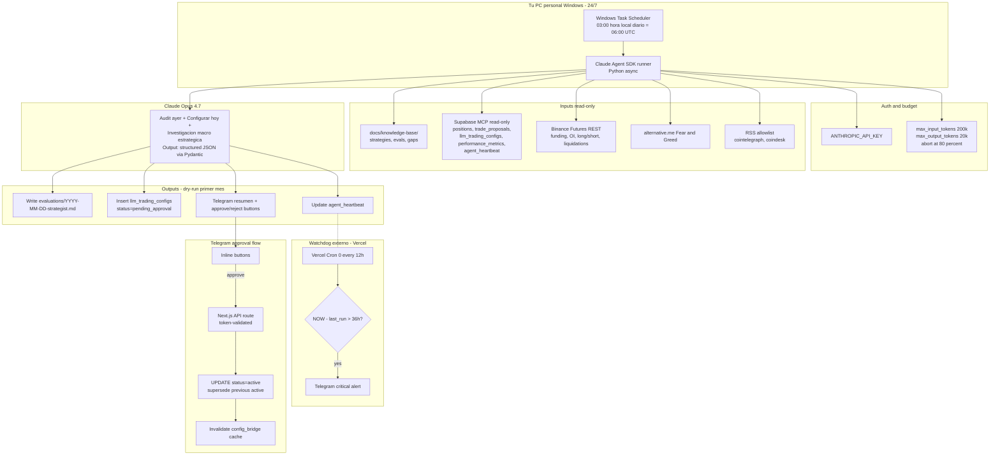

# Daily Strategist Agent + Fase 0 Prerequisites

## 1. Goal

Reemplazar el sistema **LangGraph + Gemini Flash** existente (`backend/app/services/daily_analyst/`) por un único **Claude Strategist Agent** corriendo desde la PC personal del usuario, con **Claude Opus 4.7** vía Anthropic Agent SDK. Antes del agente, ejecutar 6 correcciones críticas (Fase 0) sin las cuales sus decisiones serán ruido.

El agente combina los dos roles que hoy hace LangGraph (pre-market config + post-market audit) y agrega supervisión estratégica (revisión de la estrategia completa + research de mercado). Corre **una vez al día** a las **06:00 UTC** (3am Argentina), ventana de baja actividad.

| Sistema | Estado al 2026-04-25 | Fate |
|---|---|---|
| LangGraph pre-market 04:00 UTC (Gemini Flash) | Activo | **Decommission** en Fase 0.6 |
| LangGraph post-market 03:00 UTC (Gemini Flash) | Activo | **Decommission** en Fase 0.6 |
| Claude Strategist 06:00 UTC (Opus 4.7) | A construir | **Reemplaza ambos** |

## 2. Why now

- **Bot en break-even ruidoso**: 62 trades históricos, P&L total -$2.80. Últimos 7 días verdes (+$15.82, WR 68.8%, PF 13.26) **pero el research #2 advierte que con 13-16 trades los ratios son estadísticamente frágiles** — PBO y Deflated Sharpe existen para no creerle a ventanas chicas.
- **78% exits son STOP_LOSS, solo 3% son TAKE_PROFIT**. Síntoma central. La hipótesis de "partial exit 50% @ 1R + runner" es razonable pero **no es edge por sí sola** — es gestión de distribución R y debe pasar backtest OOS antes de prod.
- **Bug del proxy stale recién corregido**: 8 de 13 SL recientes tenían trigger ~5% menor que exec real. Sin validar el fix con 2-3 semanas más, cualquier optimización es prematura.
- **Gap de bounds desalineados**: `daily_analyst/models.py::PARAM_BOUNDS` permite valores más laxos que `signal_generator.py::LLM_SAFE_BOUNDS`. Runtime-safe pero opaco.
- **Falta contexto macro**: bot decide solo con OHLCV. Sin funding rate, OI, sentiment, news.
- **LangGraph costoso de mantener**: 2 graphs separados, modelo Gemini distinto, prompts en 2 lenguajes (LangGraph + Pydantic) — overhead de coordinación. Una sola pieza Claude simplifica.
- **Decisión usuario (2026-04-25)**: eliminar LangGraph, todo Claude.

## 3. Out of scope

- Mainnet (sigue siendo Spot Testnet).
- Multi-strategy switching automático (Fase 3+).
- Walk-forward + DSR/PBO framework completo (Fase 2 — este spec deja gates simples).
- Champion/challenger pattern (Fase 3+).
- Migración a otro stack (Freqtrade/Jesse/Nautilus). Tomamos ideas y formato, no código.
- ATR-based sizing + time-of-day filter (research #2 los recomienda — Fase 2).
- ML/sentiment models propios. El agente solo orquesta y razona; los signals duros vienen del backend Python existente.

## 4. Architecture overview



## 5. Fase 0 — Prerequisites (bloqueante)

Seis tareas. Cada una deployable independientemente. **Orden recomendado**: 5.2 + 5.5 primero (correcciones zero-risk), después 5.4 (data nueva read-only), después 5.3 (partial exit con feature flag), después 5.6 (decommission LangGraph), 5.1 corre en paralelo (es observación).

### 5.1 Validar fix del proxy con 10-20 trades nuevos post-deploy

- **Estado**: fix del proxy stale (`get_price_safe` direct-first) commiteado en `f6ba148` el 2026-04-12. Redeploy de Dokploy quedó pendiente al cierre de esa sesión.
- **Verificación inmediata**: confirmar que el backend Dokploy está corriendo el commit `f6ba148` o posterior (vía `/health` endpoint).
- **Métrica de éxito**: en los próximos 10-20 trades cerrados, `abs(trigger_price - exec_price) / exec_price < 1%` en >90% de los casos. (Pre-fix: 8/13 con drift >5%).
- **Owner**: el Strategist Agent verifica esto en cada run y reporta. **El Strategist NO propone cambios estructurales hasta que esta métrica se cumpla.**
- **Implementación**: `agents/daily-strategist/checks/proxy_drift_check.py` — query a Supabase de los últimos 20 trades, calcular drift, retornar `{passed: bool, drift_summary: dict}`.
- **Plazo estimado**: 7-14 días en testnet (depende de signal frequency).

### 5.2 Single source of truth para LLM bounds

- **Crear** `backend/app/services/llm_bounds.py` con un solo dict autoritativo:
  ```python
  LLM_SAFE_BOUNDS = {
      "buy_rsi_max":             (30.0, 55.0),
      "buy_adx_min":             (18.0, 35.0),
      "buy_entropy_max":         (0.60, 0.80),
      "sell_rsi_min":            (60.0, 75.0),
      "signal_cooldown_minutes": (120, 360),
      "sl_atr_multiplier":       (0.5, 3.0),
      "tp_atr_multiplier":       (1.0, 4.0),
      "risk_multiplier":         (0.25, 2.0),
      "max_open_positions":      (1, 3),
  }
  ```
- **Actualizar** `signal_generator.py` para importar de `llm_bounds` (no redefinir).
- **Eliminar** `daily_analyst/models.py::PARAM_BOUNDS` cuando se decommissione el LangGraph (5.6).
- **Crear** `agents/daily-strategist/schemas.py::TradingConfigOverride` con `Field(ge=, le=)` que **importa** los rangos de `llm_bounds.LLM_SAFE_BOUNDS`.
- **Test bloqueante** `tests/test_bounds_alignment.py`: si los bounds del schema no matchean exactamente con `LLM_SAFE_BOUNDS`, falla.

### 5.3 Partial exit 50% @ 1R + trailing 50% **bajo feature flag**

El research #2 advierte: **partial exit no es edge por sí solo, es gestión de distribución R**. Necesita backtest OOS antes de prod. Por eso: feature flag, A/B en testnet, decisión post-evidencia.

- **Lógica nueva** (en `backend/app/services/trading_loop.py`):
  1. `R = entry_price - sl_price` calculado al abrir.
  2. Si `current_price >= entry + 1R` → vender 50%. Mover SL del resto a breakeven.
  3. Resto sigue con trailing chandelier ya implementado.
  4. TP duro queda como exit del 100% si se alcanza antes (raro post-fix).
- **Feature flag**: env var `PARTIAL_EXIT_ENABLED=false` por default. `signal_generator` lo lee. Si `false`, lógica actual sin cambios.
- **A/B test plan**:
  - Activar `PARTIAL_EXIT_ENABLED=true` cuando 5.1 termine OK.
  - Comparar 30 trades pre vs 30 trades post.
  - Métrica: P&L medio por trade, ratio winners-capturados-completos vs partials.
  - Decisión: si P&L medio mejora >10% sin aumentar drawdown → mantener. Si no → revertir.
- **Variant experimental adicional** (research #2 detectó esto): el Chandelier actual usa `k=2.0` pero el clásico es `k=3.0` con 22 períodos. Crear flag `CHANDELIER_K` (env var, default `2.0`). Probar `3.0` después del A/B de partial exit.
- **DB**: agregar a `positions` las columnas:
  - `partial_exit_taken: bool DEFAULT false`
  - `partial_exit_price: numeric NULL`
  - `partial_exit_qty: numeric NULL`
  - `partial_exit_at: timestamptz NULL`
- **Test** `tests/test_partial_exit.py`: simular winner que sube 1.5R y retrocede al breakeven; verificar que terminó con 50% capturado a 1R + 50% a breakeven (no breakeven total).

### 5.4 Binance Futures derivatives data (read-only)

- **Cliente** `backend/app/services/derivatives_client.py` con httpx async + cache 5min.
- **Endpoints** (públicos, sin auth, rate-limit 2400/min):
  - `GET https://fapi.binance.com/fapi/v1/fundingRate?symbol=BTCUSDT&limit=50`
  - `GET https://fapi.binance.com/fapi/v1/openInterest?symbol=BTCUSDT`
  - `GET https://fapi.binance.com/futures/data/openInterestHist?symbol=BTCUSDT&period=1h&limit=24`
  - `GET https://fapi.binance.com/futures/data/topLongShortAccountRatio?symbol=BTCUSDT&period=1h&limit=24`
  - `GET https://fapi.binance.com/futures/data/topLongShortPositionRatio?symbol=BTCUSDT&period=1h&limit=24`
- **Output normalizado**:
  ```python
  {
      "symbol": "BTCUSDT",
      "funding_rate_current": 0.0001,
      "funding_rate_8h_avg": 0.00012,
      "funding_rate_trend": "rising" | "falling" | "neutral",
      "oi_current_usd": 12_345_678_901,
      "oi_change_24h_pct": -2.3,
      "long_short_ratio_24h_avg": 1.8,
      "long_short_ratio_inverting": False,
  }
  ```
- **Integración**: extender `quant_orchestrator.get_quant_snapshot()` con `derivatives: {...}`.
- **Sin cambios en signal_generator todavía**. Las decisiones de incorporar como filtro vienen del Strategist (Fase 1+).

### 5.5 Tabla `llm_trading_configs` — agregar status `pending_approval`

- **Migración** `supabase/migrations/2026-04-25_pending_approval_status.sql`:
  ```sql
  -- Agregar valores al enum status (o si es text constraint, ajustar)
  ALTER TABLE llm_trading_configs DROP CONSTRAINT IF EXISTS llm_trading_configs_status_check;
  ALTER TABLE llm_trading_configs ADD CONSTRAINT llm_trading_configs_status_check
      CHECK (status IN ('active', 'superseded', 'pending_approval', 'rejected', 'expired'));

  -- Agregar columnas
  ALTER TABLE llm_trading_configs ADD COLUMN IF NOT EXISTS proposed_by text DEFAULT 'unknown';
  ALTER TABLE llm_trading_configs ADD COLUMN IF NOT EXISTS approval_token text NULL;
  ALTER TABLE llm_trading_configs ADD COLUMN IF NOT EXISTS approved_at timestamptz NULL;
  ALTER TABLE llm_trading_configs ADD COLUMN IF NOT EXISTS approved_by text NULL;
  ALTER TABLE llm_trading_configs ADD COLUMN IF NOT EXISTS rejection_reason text NULL;

  -- Index
  CREATE INDEX IF NOT EXISTS idx_llm_configs_status_created ON llm_trading_configs(status, created_at DESC);
  ```
- **Endpoint Next.js** `app/api/admin/approve-config/route.ts`:
  - `GET /api/admin/approve-config?token=<approval_token>&id=<row_id>` → promueve a active.
  - `GET /api/admin/reject-config?token=...&id=...` → marca rejected.
  - Token validation con `crypto.timingSafeEqual` contra env var `STRATEGIST_APPROVAL_TOKEN`.
  - **Idempotente**: si ya está active/rejected, devuelve 200 con mensaje "already processed".
- **Cleanup job**: `pending_approval` con `expires_at < now()` → `UPDATE status='expired'`. Vercel Cron diario.

### 5.6 Decommission LangGraph daily_analyst

Migración graceful — no romper el bot durante la transición.

- **Día -7 a Día 0**: Strategist en dry-run (Fase 1 desplegada). LangGraph sigue activo.
- **Día 0**: cuando Strategist tenga 7 días seguidos generando configs aceptables (manualmente revisados), pausar LangGraph.
- **Pasos de pausa**:
  1. En `backend/app/main.py` (o donde esté el scheduler loop), comentar las llamadas a `should_run_pre_market`/`should_run_post_market` con un flag `LANGGRAPH_DAILY_ENABLED=false`.
  2. Un commit + redeploy.
  3. Verificar que `llm_trading_configs` ya no recibe rows de `source='llm_premarket'`.
  4. **No borrar el código todavía** — dejar 2 semanas como rollback option.
- **Día +14**: si Strategist sigue OK, eliminar:
  - `backend/app/services/daily_analyst/` (entero)
  - Imports/llamadas en `main.py`
  - Tabla `llm_audit_reports` queda como histórico read-only (no se borra; el Strategist puede leerla para context).
- **Riesgo**: si Strategist falla, no hay fallback automático. Mitigación: Vercel Cron watchdog avisa, y `signal_generator` cae a defaults de `config.py` si no hay config active (comportamiento existente).

## 6. Fase 1 — Daily Strategist Agent

### 6.1 Hosting

PC personal Windows del usuario, siempre encendida. Trigger: Windows Task Scheduler.

- **Trigger**: Daily at 03:00 hora local AR (= 06:00 UTC).
- **Action**: `powershell.exe -ExecutionPolicy Bypass -File C:\...\run-strategist.ps1`.
- **Settings**:
  - Run whether user is logged on or not.
  - Wake the computer to run this task: yes.
  - If the task fails, restart every 30 minutes, max 3 attempts.
  - Stop task if runs longer than 60 minutes.
  - **No** "Run with highest privileges" (no necesario).
- **Script** `scripts/run-strategist.ps1`:
  ```powershell
  $ErrorActionPreference = "Stop"
  cd "C:\Users\nahue\Documents\PROYECTOS\traiding-agentic"
  & .\venv\Scripts\Activate.ps1
  $env:STRATEGIST_RUN_AT = (Get-Date -Format "o")
  python -m agents.daily_strategist 2>&1 | Tee-Object -FilePath "logs\strategist-$(Get-Date -Format 'yyyy-MM-dd').log"
  if ($LASTEXITCODE -ne 0) {
      python -c "from agents.daily_strategist.outputs.telegram_summary import send_failure_alert; send_failure_alert($LASTEXITCODE)"
  }
  ```

### 6.2 Auth

`ANTHROPIC_API_KEY` (NO OAuth Claude Code subscription, según recomendación oficial Anthropic).

- **Variable**: `ANTHROPIC_API_KEY` en `.env.strategist` (gitignored, no commiteado).
- **Budget cap**:
  - `MAX_INPUT_TOKENS_PER_RUN=200000`
  - `MAX_OUTPUT_TOKENS_PER_RUN=20000`
  - Abort al 80% (160k input o 16k output).
- **Cost expected**: Opus 4.7 a $5/MTok input + $25/MTok output. Estimado por sesión: 100k input + 10k output = $0.75/día = $22/mes. Alerta Anthropic console al 50% del budget mensual.

### 6.3 SDK choice

**Python** — consistencia con backend FastAPI Python. Anthropic Agent SDK Python.

```bash
pip install claude-agent-sdk anthropic
```

### 6.4 Estructura de directorios

```
agents/
└── daily_strategist/
    ├── __init__.py
    ├── __main__.py              # entry point (python -m agents.daily_strategist)
    ├── main.py                  # async run_daily_strategist()
    ├── prompts.py               # STRATEGIST_SYSTEM_PROMPT + DAILY_TASK_PROMPT
    ├── schemas.py               # TradingConfigOverride, EvalReport (Pydantic)
    ├── config.py                # ALLOWED_TOOLS, WEBFETCH_ALLOWED_DOMAINS, BASH_DENY_PATTERNS
    ├── checks/
    │   ├── __init__.py
    │   ├── proxy_drift_check.py
    │   ├── data_quality_gate.py
    │   └── budget_check.py
    ├── tools/
    │   ├── __init__.py
    │   ├── kb_reader.py         # custom tool: read KB markdown only
    │   ├── derivatives.py       # wrapper a backend/app/services/derivatives_client
    │   ├── fear_greed.py
    │   └── supabase_query.py    # whitelisted tables only
    ├── outputs/
    │   ├── __init__.py
    │   ├── eval_writer.py       # writes evaluations/YYYY-MM-DD-strategist.md
    │   ├── pending_config.py    # writes llm_trading_configs row
    │   ├── telegram_summary.py  # message + inline approve/reject buttons
    │   └── heartbeat.py
    └── tests/
        ├── __init__.py
        ├── test_main.py
        ├── test_schemas.py
        └── test_proxy_drift_check.py
```

### 6.5 Tools allowlist (estricto)

Domain allowlist más restrictiva que la versión inicial — el research #2 enfatizó la importancia de evitar "research storms".

```python
WEBFETCH_ALLOWED_DOMAINS = [
    # Binance (data oficial)
    "fapi.binance.com",
    "api.binance.com",
    "developers.binance.com",
    # Sentiment público
    "api.alternative.me",
    # News (RSS feeds específicos)
    "cointelegraph.com/rss",
    "www.coindesk.com/arc/outboundfeeds",
    # Papers académicos (research solamente)
    "arxiv.org/abs",
    "arxiv.org/pdf",
    "papers.ssrn.com",
    # Anthropic docs (referencia técnica)
    "docs.anthropic.com",
]

# Bloqueado explícitamente — el agente puede pedir, falla siempre
WEBFETCH_BLOCKED_DOMAINS_PATTERNS = [
    r"twitter\.com", r"x\.com",
    r"reddit\.com",
    r"github\.com",                  # acceso a código random no se necesita
    r"medium\.com",                  # ruido alto
    r"tradingview\.com",             # display, no decision
    r"discord\.gg", r"telegram\.me",
    r"youtube\.com",
    r"\.onion",
]

WEBSEARCH_ALLOWED = True              # Claude tool nativo, no se filtra dominio
WEBSEARCH_QUERY_BUDGET = 10           # max 10 searches per run

ALLOWED_TOOLS = [
    "Read",                           # FS allowlist: docs/, agents/, backend/app/services/llm_bounds.py
    "Write",                          # FS allowlist: docs/knowledge-base/evaluations/, logs/
    "Glob",                           # read-only listing
    "Grep",                           # read-only search
    "WebSearch",                      # Anthropic native, query budget
    "WebFetch",                       # domain allowlist
    "Bash",                           # whitelisted scripts only
    {
        "name": "kb_reader",
        "type": "custom",
        "module": "agents.daily_strategist.tools.kb_reader",
    },
    {
        "name": "supabase_query",
        "type": "custom",
        "module": "agents.daily_strategist.tools.supabase_query",
        "scope": "read",
        "tables": [
            "positions", "trade_proposals", "regime_snapshots",
            "llm_trading_configs", "llm_audit_reports",
            "performance_metrics", "agent_heartbeat",
        ],
    },
    {
        "name": "binance_derivatives",
        "type": "custom",
        "module": "agents.daily_strategist.tools.derivatives",
    },
    {
        "name": "fear_greed_index",
        "type": "custom",
        "module": "agents.daily_strategist.tools.fear_greed",
    },
]

BASH_ALLOWED_SCRIPTS = [
    "scripts/refresh-market-context.py",
    "scripts/check-proxy-drift.py",   # nuevo helper, lee Supabase y calcula drift
]

BASH_DENY_PATTERNS = [
    r"git\s+(push|commit|merge|rebase|reset|checkout)",
    r"rm\s+",
    r"docker\s+",
    r"npm\s+(publish|install)",
    r"pip\s+install",
    r"curl.*\|.*sh",
    r">\s*\.env",
    r"\.env\.",
    r"chmod\s+",
    r"sudo\s+",
]
```

### 6.6 System prompt (esqueleto en `prompts.py`)

```
You are the Strategist Agent. You run once daily at 06:00 UTC to evaluate the
trading bot's strategy and propose adjustments.

# Hard rules (non-negotiable)

- DRY-RUN MODE: NEVER modify llm_trading_configs with status='active'.
  ONLY insert with status='pending_approval'. Human approves via Telegram.
- ALL parameter proposals MUST be inside LLM_SAFE_BOUNDS (provided below).
  If you want a value outside, flag it as RECOMMENDATION_FOR_HUMAN, do NOT insert.
- NEVER use git, docker, deploy, or any write tool outside docs/knowledge-base/evaluations/.
- If proxy_drift_check fails: ABORT decision-making. Write evaluation marked
  "BLOCKED: data quality" and exit. NO config proposals.
- If you exceed 80% of token budget: finalize report with what you have, exit.
- Minimum evidence threshold: each parameter change must cite >=3 distinct
  data points (e.g., "ETH win rate 78% over 9 trades", "BTC funding flipped
  negative 36h ago", "Fear&Greed dropped from 72 to 48").
- Config cooldown: do NOT propose changes to a parameter that was changed in
  the last 72 hours unless there's a hard regime shift (>2 red flags).

# Current strategy
{insert: docs/knowledge-base/strategies/01-trend-momentum.md}

# Decision matrix
{insert: docs/knowledge-base/decision-matrix.md}

# Hard bounds
{insert: backend/app/services/llm_bounds.py LLM_SAFE_BOUNDS}

# Your role each day

1. AUDIT yesterday: read positions closed yesterday, P&L, exits taken.
   Compare with the active config that was used (status=active in
   llm_trading_configs at the start of yesterday).

2. ASSESS data quality: run proxy_drift_check. If fail, abort.

3. INVESTIGATE macro context:
   - Fear & Greed (current + 7d trend)
   - Funding rates per symbol (current + 8h avg + trend)
   - OI 24h change per symbol
   - Long/short ratio inverting?
   - News last 24h via WebSearch (limited to 10 queries)

4. DECIDE one of:
   - KEEP_AS_IS: today's config = yesterday's active. No insert.
   - TWEAK_PARAMS: propose new values within LLM_SAFE_BOUNDS.
     Insert pending_approval row with reasoning.
   - PROPOSE_STRATEGY_CHANGE: write recommendation in eval markdown.
     DO NOT insert config row. Human must read and decide.
   - RECOMMEND_PAUSE: explain trigger, propose duration.
     Insert pending_approval row with risk_multiplier=0.0 (pauses bot).

5. WRITE evaluation: docs/knowledge-base/evaluations/YYYY-MM-DD-strategist.md
   Sections: Summary | Data Quality | Performance Review | Macro Context |
             Comparison vs Yesterday Config | Decision | Proposed Changes |
             Risks | Confidence (0-1)

6. NOTIFY Telegram with summary + inline approve/reject buttons.

7. UPDATE agent_heartbeat with success status, eval path, tokens used.

# Anti-patterns to avoid
- Changing parameters every day (overfitting to noise).
- Inferring strategy edge from <100 trades.
- Trusting WR or PF alone over short windows.
- Recommending mainnet migration without 2-3 weeks clean testnet data.
```

### 6.7 Approval flow Telegram

- Message del Strategist incluye 2 inline buttons: ✅ Approve y ❌ Reject.
- Cada button es URL con `?token=<approval_token>&id=<config_row_id>`.
- Endpoint Next.js valida token con `crypto.timingSafeEqual` y procesa.
- **Token rotation**: regenerar `STRATEGIST_APPROVAL_TOKEN` cada deploy de Next.js. Si rotó después de mandar el mensaje y el usuario tarda en aprobar, falla → Telegram avisa "config expirado, esperar el del próximo run".

### 6.8 Watchdog

- **Vercel Cron**: schedule `0 */12 * * *` (cada 12h, gratis en Hobby).
- **Endpoint** `app/api/cron/strategist-watchdog/route.ts`.
- **Lógica**: lee `agent_heartbeat` para `agent_name='strategist'`. Si `now - last_run_at > 36h` → Telegram alert crítico.
- **Self-healing none**: el watchdog solo notifica. La PC offline requiere intervención humana.

## 7. Guardrails consolidados

| Riesgo | Mitigación |
|---|---|
| Doble corrida | Supabase advisory lock con TTL 30min al inicio del run |
| Budget descontrolado | `MAX_*_TOKENS_PER_RUN`, abort al 80%, alerta Anthropic console |
| Cambios fuera de safe bounds | Pydantic Field constraints importan `LLM_SAFE_BOUNDS`; clamp explícito |
| Cambios auto a config active | **Dry-run primer mes**: solo `pending_approval`. Aprobación humana via Telegram. |
| Network failure | Catch + degraded mode (eval con menos data + flag `DEGRADED_RUN`) |
| LLM hallucinations / JSON parse | Pydantic schema strict. Si falla parse → eval con flag `LLM_PARSE_FAILED`, sin config |
| Bash arbitrario | `BASH_ALLOWED_SCRIPTS` whitelist + `BASH_DENY_PATTERNS` regex |
| WebFetch arbitrario | `WEBFETCH_ALLOWED_DOMAINS` whitelist + `WEBFETCH_BLOCKED_PATTERNS` denylist |
| Research storm | `WEBSEARCH_QUERY_BUDGET=10`, `WEBFETCH_QUERY_BUDGET=15` |
| PC offline / Task Scheduler skip | Vercel Cron watchdog cada 12h + Telegram alert si >36h |
| Token expuesto en logs | Logging filter regex `r"sk-ant-[A-Za-z0-9_-]+"` → `[REDACTED]` |
| Overfitting a ventanas chicas | Minimum evidence threshold (>=3 data points cited per change), cooldown 72h por parámetro |
| Drift entre prompt e intent | Tests E2E con LLM mockeado verifican que dry-run NO toca status=active |
| LLM "deceptive under pressure" (Apollo paper) | Correa corta: agente no tiene autoridad de deploy ni git push. Sólo escribe markdown + propone config. |

## 8. Testing strategy

### Unit
- `tests/test_bounds_alignment.py`: schema vs `LLM_SAFE_BOUNDS` exact match.
- `tests/test_partial_exit.py`: simulaciones (winner→retreat, loser, runner).
- `tests/test_derivatives_client.py`: mocks Binance Futures responses.
- `agents/daily_strategist/tests/test_schemas.py`: Pydantic validation rejects out-of-bounds.

### Integration
- `agents/daily_strategist/tests/test_main_dry_run.py`: corre flow contra Supabase testnet con `MOCK_LLM=true`. Verifica eval markdown + pending row + heartbeat. Verifica que NO hubo escritura a status=active.

### Manual smoke (pre-Task-Scheduler)
```powershell
$env:DRY_RUN = "true"
$env:MOCK_LLM = "false"
$env:MAX_OUTPUT_TOKENS_PER_RUN = "5000"  # más barato la primera vez
python -m agents.daily_strategist
# Verificar:
# - logs/strategist-YYYY-MM-DD.log sin errores
# - docs/knowledge-base/evaluations/YYYY-MM-DD-strategist.md generado
# - Supabase llm_trading_configs nueva row status=pending_approval
# - Telegram recibido con buttons
# - agent_heartbeat con last_run_at = ahora
# - Budget consumido <$1
```

## 9. Risk register

| # | Riesgo | Prob | Impacto | Mitigación |
|---|---|---|---|---|
| 1 | Data stale del proxy todavía no validada | Alta | Alto | proxy_drift_check antes de cada run |
| 2 | Costo Anthropic API se dispara | Media | Medio | Budget cap por run + alerta console |
| 3 | LLM cambia parámetros por narrativa diaria | Alta | Alto | Minimum evidence + cooldown 72h por parámetro |
| 4 | PC offline en momento del cron | Media | Bajo | Watchdog + retry Task Scheduler |
| 5 | Pending_approval acumulando sin aprobar | Media | Bajo | `expires_at` 24h + cleanup diario |
| 6 | LangGraph sigue activo en paralelo creando ruido | Alta | Medio | Decommission planificado en 5.6 con día 0 explícito |
| 7 | Partial exit empeora P&L | Media | Medio | Feature flag + A/B 30 trades antes de mantener |
| 8 | LLM propone cambios fuera de bounds | Baja | Alto | Pydantic strict + clamp |
| 9 | Overfitting a 13-trade window | Alta | Medio | No actuar con <100 trades; eval flag "FRAGILE_SAMPLE" |
| 10 | LLM "deceives under pressure" para justificar cambios | Baja | Alto | Correa corta: no autoridad deploy/git |

## 10. Success criteria

### Fase 0 (todas deben cumplirse antes de habilitar Strategist)
- [ ] **5.1**: 10+ trades nuevos con `drift < 1%` en >90%.
- [ ] **5.2**: `test_bounds_alignment` pasa en CI.
- [ ] **5.3**: `test_partial_exit` pasa; feature flag desplegado (off por default).
- [ ] **5.4**: `derivatives_client` retorna data válida para BTCUSDT y ETHUSDT en local + en backend Dokploy.
- [ ] **5.5**: Migración aplicada; endpoint `/api/admin/approve-config` funcional con curl.
- [ ] **5.6**: Plan de decommission documentado en KB.

### Fase 1 (gates antes de promover a auto-approve)
- [ ] Strategist corre 7 días seguidos sin fallar (heartbeat OK).
- [ ] Cada run produce eval + pending + Telegram + heartbeat.
- [ ] Costo medio <$1.50/día.
- [ ] Cero modificaciones a `status=active` por el agente.
- [ ] Aprobaciones manuales registradas con razón.
- [ ] 4 semanas de dry-run con calidad subjetiva alta (criterio del usuario).

## 11. Rollout plan (alineado al plan extractivo del research #2)

### Semana 1 — Fundamentos zero/low risk
- 5.2 (single source of truth bounds) + tests
- 5.5 (pending_approval migration + endpoint)
- 5.4 (derivatives client read-only)
- Lectura paralela: Freqtrade `optimize/backtesting.py`, `hyperopt_loss`, `protections`. **Solo formato**, no copiar código (GPL incompatible).
- Lectura paralela: Jesse `strategies/Strategy.py` y tests de TP/SL spot.

### Semana 2 — Cambios con feature flag + agente
- 5.3 (partial exit feature flag, off por default) + tests
- Notebook vectorbt comparando: all-out TP vs partial @1R vs Chandelier 2ATR vs 3ATR.
- Construir `agents/daily_strategist/` skeleton con MOCK_LLM.
- Smoke test manual del Strategist en local.

### Semana 3 — Strategist en dry-run
- Activar Task Scheduler.
- Strategist corre cada día, dry-run, manual approval.
- Activar `PARTIAL_EXIT_ENABLED=true` en backend (5.1 ya cumplido).
- Empezar A/B de partial exit (30 trades pre vs post).

### Semana 4-7 — Observación
- Strategist sigue dry-run.
- A/B partial exit termina (~30 trades).
- Si A/B positivo: mantener. Si negativo: revertir flag.
- Evaluar Chandelier 3ATR experiment.

### Semana 8 — Decommission LangGraph + Promote
- 5.6 día 0: pausar LangGraph daily_analyst.
- Si Strategist mantuvo calidad 4 semanas: habilitar auto-approve para cambios DENTRO de safe bounds. Cambios fuera siguen requiring manual.

### Semana 10+ — Cleanup
- Eliminar `backend/app/services/daily_analyst/` (entero).
- Documentar lecciones en KB.

## 12. Open questions / decisions

| # | Q | Decisión |
|---|---|---|
| Q1 | ¿Strategist también fines de semana? | **SÍ** desde día 1. Testnet no para. Si calidad baja en weekends, revisar después. |
| Q2 | ¿Catch-up si PC offline? | **NO** retroactiva. Reportar `missed_runs` en eval del día actual y operar normal. |
| Q3 | ¿Daily o weekly summary también? | **Solo daily** en MVP. Weekly summary puede venir como agregador en Next.js dashboard, no otro agente. |
| Q4 | ¿LLM_SAFE_BOUNDS son negociables por el agente? | **NO**. Humano modifica `llm_bounds.py` con post-mortem. Agente solo recomienda cambios. |
| Q5 | ¿Token approval rotación? | Cada deploy de Next.js. Más estricto. |
| Q6 | ¿Qué pasa si Strategist falla 3 días seguidos? | Watchdog alerta. Backend queda con último config active o defaults. NO fallback automático a LangGraph (decommissioned). |
| Q7 | ¿ATR sizing + time-of-day filter? | **Fase 2**, fuera de este spec. |
| Q8 | ¿Walk-forward + DSR/PBO automatizado? | **Fase 2**. Por ahora: minimum evidence + cooldown como guardrails simples. |

## 13. References

### Internal
- `docs/knowledge-base/strategies/01-trend-momentum.md`
- `docs/knowledge-base/research/2026-04-05-post-mortem-49trades.md`
- `docs/knowledge-base/evaluations/2026-04-12-0220.md`
- `docs/knowledge-base/research/gaps.md`
- `backend/app/services/signal_generator.py` (LLM_SAFE_BOUNDS pre-migración)
- `backend/app/services/daily_analyst/` (sistema a decommissionar)

### External — Anthropic
- Claude Agent SDK: https://platform.claude.com/docs/en/agent-sdk/overview
- Permissions: https://platform.claude.com/docs/en/agent-sdk/permissions
- Secure deployment: https://docs.anthropic.com/en/agent-sdk/secure-deployment

### External — Binance
- Futures API funding: https://developers.binance.com/docs/derivatives/usds-margined-futures/market-data/rest-api/Get-Funding-Rate-History
- Futures API OI: https://developers.binance.com/docs/derivatives/usds-margined-futures/market-data/rest-api/Open-Interest
- Futures API top ratio: https://developers.binance.com/docs/derivatives/usds-margined-futures/market-data/rest-api/Top-Trader-Long-Short-Ratio

### External — Research (research #2 findings)
- PBO (Probability of Backtest Overfitting): https://papers.ssrn.com/sol3/papers.cfm?abstract_id=2326253
- Deflated Sharpe Ratio: https://www.davidhbailey.com/dhbpapers/deflated-sharpe.pdf
- Van Tharp R-multiples: https://vantharp.com/wp-content/uploads/2018/06/A_Short_Lesson_on_R_and_R-multiple.pdf
- Chandelier Exit (StockCharts): https://chartschool.stockcharts.com/table-of-contents/technical-indicators-and-overlays/technical-overlays/chandelier-exit
- LLM Agent in Financial Trading Survey: https://arxiv.org/abs/2408.06361
- LLMs strategically deceive under pressure: https://openreview.net/pdf?id=HduMpot9sJ
- Regime-aware agentic portfolio framework: https://link.springer.com/article/10.1007/s41060-026-01066-0

### External — Repos (research #2 priorizado)
- Freqtrade (formato reportes, hyperopt, protections — solo lectura, GPL): https://github.com/freqtrade/freqtrade
- Jesse (lifecycle estrategia, TP/SL parciales — MIT): https://github.com/jesse-ai/jesse
- vectorbt (notebooks research — Commons Clause): https://vectorbt.dev/
